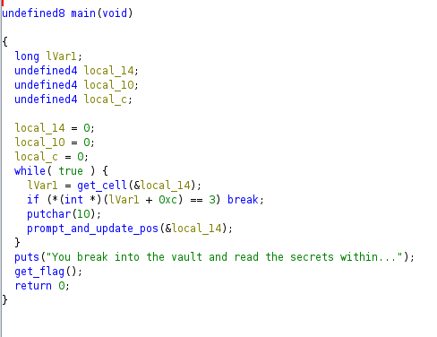
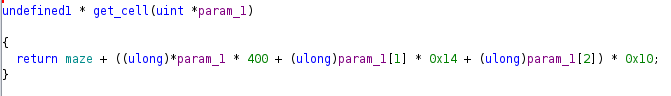
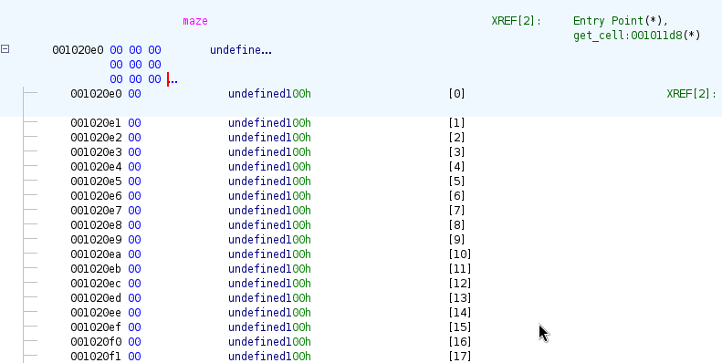
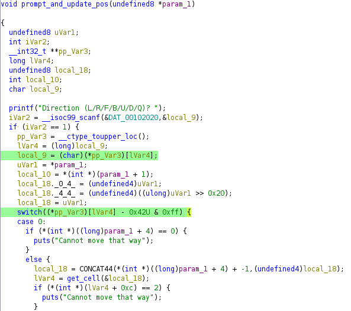
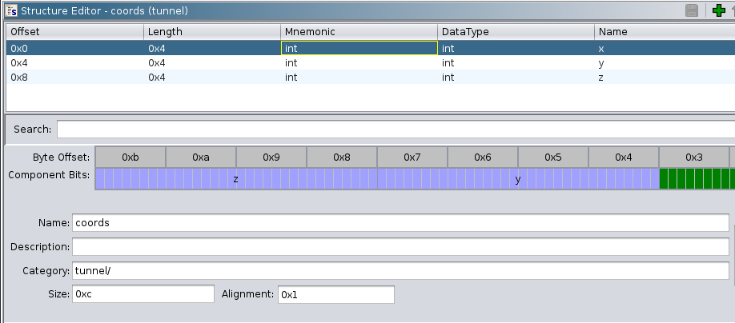
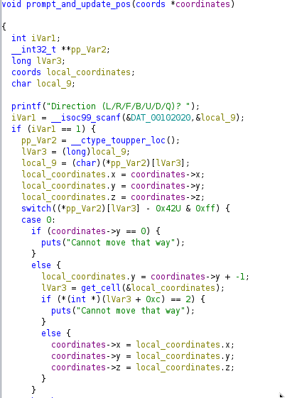
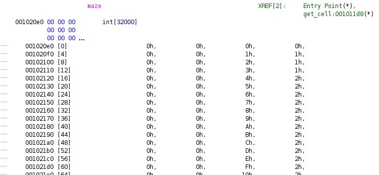
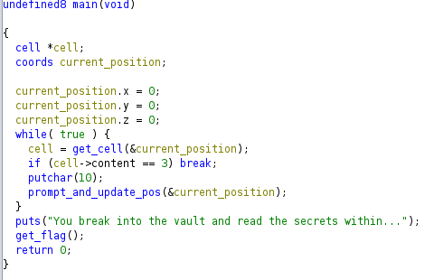

# Tunnel Madness Writeup

## Introduction 
First of all I wanted to say this was the most entertaining challenge for me during the **HTB Business CTF 2024**.\
I enjoyed it because it was a game in the game, and I love games.

The zip content is only a 64 bit Linux executable named `tunnel`.
By starting it, the only thing we can see is it asking us for what seems to be directions:

```
Direction (L/R/F/B/U/D/Q)?
```

We can see that we can go either `Left`, `Right`, `Forward`, `Backward`, `Up` and `Down`. This must be a three-dimensions labirynth.\
It's clear that we must open Ghidra for new esotic and undocumented patterns of headache!

## Analysis
So just create a new project and import `tunnel`. After the automatic analysis we can see that the binary has symbols, which is almost always a thing to appreciate.

### main


The `main` is very simple and straightforward:

`while true`:
- `get_cell()`
- if `cell` + `0xc` == `3`, `break`
- else get input and update position

Once exited from the cycle:
- `get_flag()`

### get_cell
The `get_cell` function is relatively clear:



Given a pointer to something, it dereferences it three times to obtain some sort of offsets.\
The return value is `maze` + this calculated offset.\
By looking at the maze pointer we discover that it is a 128KB buffer stored in the executable itself:

### maze


### prompt_and_update_pos
The `prompt_and_update_pos` function seems to do exactly what his name suggests.\
It is in fact composed by a undefined8 pointer named `param_1`, some local variables, the `printf` that asks for direction, a `scanf` call with a `%c` format and a big `switch` statement.

Remember that this `param_1` is the same passed as argument to the `get_cell` function, which is named as `local_14` inside `main` and seems to be a structure of some size.\
It is allocated on `main`'s stack space and 



After a bit of analysis we can see that the `local_9` variable should be the lowercase version of the input character, but it's not used for unknown reason and it is repeated inside the `switch` argument, which is, again, the lowercase inputted char but also decremented by `0x42`.

Anyway, by diving into the `switch` body we can easily tell that each `case` compares with the L/R/F/B/U/D direction given before (*lowercaseinput - 0x42*).

Each `case` does almost the same thing:

- Dereferences, as a int, the (`param_1` + someoffset) to check if the content matches `0` or `0x13`. This must be some kind of boundary.
- Else, it performs a not-very-clear computaton on `param_1` and `local_18` and then gives the result to `get_cell`. This could be the code for checking if the next cell is "walkable" or not.
- The output from `get_cell` gets once again dereferenced by the 0xC offset. Now it gets tested against 0x2.
- If that matches then we get told that we "cannot move that way".
- Else... `param_1` gets updated with the `local_18` var! And also `param_1 + 1` gets updated by `local_10` variable, which is defined as `*(int *)(param_1 + 1)` at the start of the function.

At this point becomes very clear that `param_1` and `local_18` are a coordinates struct.

### Coordinates structure
Let's then go in the Ghidra's `Data Type Manager` and create this structure, which could be made, based on the dereferences on the code, by three `int` items:



Yeah, three `int` acting exactly like a coordinate system, we must name them `x`, `y` and `z` :D\
After creating it, let's apply this structure to `param_1` and `local_18`:

The code now becomes waaaaaay much clearer:



### Cell structure

Let's parse the previous `maze` buffer with `int` type:



We can see that it's another structure but composed by four elements this time. I highly suspect, since it's the maze variable, these value are `x`, `y`, `z` and its `content`.\
Notice how the last element is, most of the times, `2`, which if you remember, it is what the output of `get_cell` got tested against in all `case` statements inside `prompt_and_update_pos` function.

Create another data structure, but with these four elements and apply it to the `maze` variable.\
You can notice how we obtain a 8000 elements array with the four elements in it, where `content` is almost always `2`, but it could also be `0`, `1`, and.... `3`!

### Breaking in the vault
If you recall from the `main` function.. if the content pointed from `get_cell` output got successfully tested against `3`, the cycle would break and the `get_flag` function would be called.\
Now with the correct data structure we can see that it's the `content` element that get's tested for `3`:



Now the only two things remaining to do are:
- Find the cell with the `3` content.
- Try to reach it with the available controls.

For serving these purposes we need to dump the `maze` content and parse it in order to produce a map of this multi-layer maze.\
You can find the `matrix.py` and `maze.bin` files in this repo already, but of course you are welcomed to do it yourself too!

By running the `matrix.py` script we parse the data structure and print each layer of the maze:

```
...
Layer[5]:
[W][W][W][W][W][W][W][W][W][W][W][W][W][W][W][W][W][W][W][W]
[W][W][W][W][W][W][W][W][W][W][W][W][W][W][W][W][W][W][W][W]
[W][W][W][W][W][W][W][W][W][W][W][W][W][W][W][W][W][W][W][W]
[W][W][W][W][W][W][W][W][W][W][W][W][W][W][W][W][W][W][W][W]
[W][W][W][W][W][W][W][W][W][W][W][W][W][W][W][W][W][W][W][W]
[W][W][W][W][W][W][W][W][W][W][W][W][W][W][W][W][W][W][W][W]
[W][W][W][W][W][W][W][W][W][W][W][W][W][W][W][W][W][W][W][W]
[W][W][W][W][W][W][W][W][W][W][W][W][W][W][W][W][W][W][W][W]
[W][W][W][W][W][W][W][W][W][W][W][W][W][W][W][W][W][W][W][W]
[W][W][W][W][W][W][W][W][W][W][W][W][W][W][W][W][W][W][W][W]
[W][W][W][W][W][W][W][W][W][W][W][W][W][W][W][W][W][W][W][W]
[W][W][W][W][W][W][W][W][W][W][W][W][W][W][W][W][W][W][W][W]
[W][W][W][W][W][W][W][W][W][W][W][W][W][W][W][W][W][W][W][W]
[W][W][W][W][W][W][W][W][W][W][W][W][W][W][W][W][W][W][W][W]
[W][W][W][W][W][W][W][W][W][W][W][W][W][W][W][W][W][W][W][W]
[W][W][W][W][W][W][.][W][W][W][W][W][W][W][W][W][W][W][W][W]
[W][W][W][W][W][W][.][W][W][W][W][W][W][W][W][W][W][W][W][W]
[W][W][W][W][.][.][.][W][W][W][W][W][W][W][W][W][W][W][W][W]
[W][W][.][.][.][W][W][W][W][W][W][W][W][W][W][W][W][W][W][W]
[W][W][W][W][W][W][W][W][W][W][W][W][W][W][W][W][W][W][W][W]
...
```

At this point I leave to the reader the pleasure to solve the game on himself.

And yes I could have written a script that walked adjacent cells and printed the direction, but I wanted to see the maze with my eyes.

## Conclusion

Thank you for reading my writeup :)

This was by far the most entertaining challenge I had the opportunity to solve during the **HTB Business CTF 2024**.

Thanks to the **HackTheBox** team for developing such good work, and thanks to my colleagues for joining the CTF with me of course!
